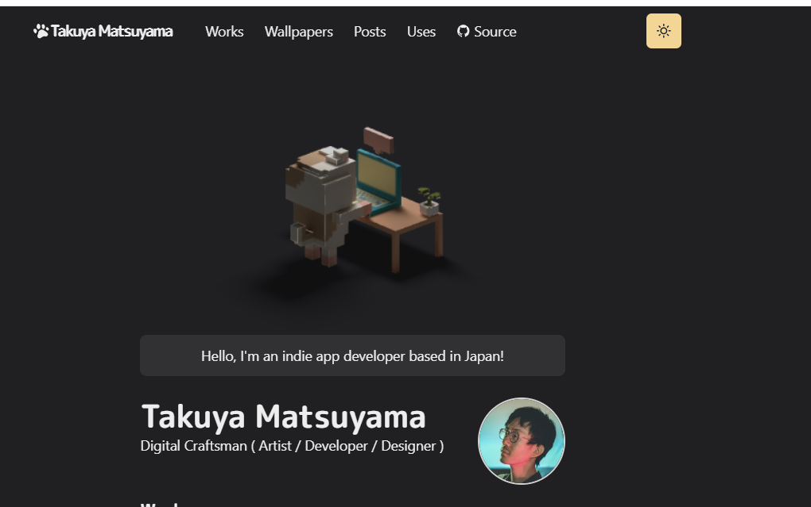

<div align="center">

# 0730 · 实用技能应用研究

**「理论 + 实战 = 能上线的真东西。」**

> 一个多项目研究容器。每个项目是一个独立的设计 / 前端实战,
> 从「学到的理论」到「真实落地的页面 / 模块」走完全闭环。

</div>

---

## 这是什么库

这是一个用于探索「把设计 / 前端技能学到能用」的 **多项目研究容器**。

- **学 + 用 两层并行**:在每个项目内部,先学上游理论(Skill / 设计系统 / 文档),
  再用所学方法真实搭建可交付的页面 / 模块。
- **每个项目独立**:每个项目是一个子目录,可以单独打开、独立部署、独立二次开发。
- **持续累积**:随着项目越来越多,容器里沉淀下来的方法论与可复用资产也越来越厚。

---

## 在线访问（GitHub Pages）

部署在 GitHub Pages 上，**100% 静态**（无后端、无构建步骤）：

| 路径 | 内容 |
|---|---|
| [`/`](https://yydshly.github.io/0730_practical-skill-study/) | 仓库总入口（多项目索引） |
| [`/finesse-skill-study/examples-index.html`](https://yydshly.github.io/0730_practical-skill-study/finesse-skill-study/examples-index.html) | 项目 1 · 13 个范例索引 |
| [`/finesse-skill-study/capabilities.html`](https://yydshly.github.io/0730_practical-skill-study/finesse-skill-study/capabilities.html) | 项目 1 · 能力全景 + 决策树 |
| [`/finesse-skill-study/prompt-builder.html`](https://yydshly.github.io/0730_practical-skill-study/finesse-skill-study/prompt-builder.html) | 项目 1 · Prompt 自动拼装 |
| [`/finesse-skill-study/family-orchard/`](https://yydshly.github.io/0730_practical-skill-study/finesse-skill-study/family-orchard/) | 项目 1 子交付物 · 拾穗果园 |
| [`/mengto-skills-study/`](https://yydshly.github.io/0730_practical-skill-study/mengto-skills-study/) | 项目 2 研究总览 |
| [`/craftzdog-homepage/`](./craftzdog-homepage/) | 项目 3 · 3D 模型加载（需本地 `npm run dev` 运行，非 GitHub Pages） |
| [`/mengto-skills-study/demo-gallery.html`](https://yydshly.github.io/0730_practical-skill-study/mengto-skills-study/demo-gallery.html) | 项目 2 · Demo 展示（89 个可运行） |
| [`/mengto-skills-study/capability-map.html`](https://yydshly.github.io/0730_practical-skill-study/mengto-skills-study/capability-map.html) | 项目 2 · 能力地图（决策树） |
| [`/mengto-skills-study/scene-testing.html`](https://yydshly.github.io/0730_practical-skill-study/mengto-skills-study/scene-testing.html) | 项目 2 · 场景测试（4 技能验证） |
| [`/mengto-skills-study/workflow-demo.html`](https://yydshly.github.io/0730_practical-skill-study/mengto-skills-study/workflow-demo.html) | 项目 2 · 工作流实战（4 步闭环） |
| [`/mengto-skills-study/skill-reference.html`](https://yydshly.github.io/0730_practical-skill-study/mengto-skills-study/skill-reference.html) | 项目 2 · 18 Codex Skills 参考手册 |
| [`/mengto-skills-study/web-design-reference.html`](https://yydshly.github.io/0730_practical-skill-study/mengto-skills-study/web-design-reference.html) | 项目 2 · 11 Web Design Skills 参考手册 |
| [`/mengto-skills-study/game-dev-reference.html`](https://yydshly.github.io/0730_practical-skill-study/mengto-skills-study/game-dev-reference.html) | 项目 2 · 19 Game Dev Skills 参考手册 |
| [`/mengto-skills-study/patterns-reference.html`](https://yydshly.github.io/0730_practical-skill-study/mengto-skills-study/patterns-reference.html) | 项目 3 · 15 设计模式速查 |
| [`/mengto-skills-study/custom-skills-reference.html`](https://yydshly.github.io/0730_practical-skill-study/mengto-skills-study/custom-skills-reference.html) | 项目 3 · 5 个原创 Agent Skills |
| [`/female-portrait-director-demo/`](https://yydshly.github.io/0730_practical-skill-study/female-portrait-director-demo/) | 项目 4a · 上游技能演示（20 风格 + 导演式扩写） |
| [`/female-portrait-director-demo/playground/`](https://yydshly.github.io/0730_practical-skill-study/female-portrait-director-demo/playground/) | 项目 4b · Playground（推荐 · MiniMax API 生图） |
| [`/female-portrait-style-gallery/`](https://yydshly.github.io/0730_practical-skill-study/female-portrait-style-gallery/) | 项目 4c · 静态风格画廊（20 风格参考图浏览） |
| [`/gc-minimal-zine-poster/`](https://yydshly.github.io/0730_practical-skill-study/gc-minimal-zine-poster/) | 项目 5 · 极简 ZINE 海报技能仓库与研究说明 |
| [`/gc-minimal-zine-poster/demo/`](https://yydshly.github.io/0730_practical-skill-study/gc-minimal-zine-poster/demo/) | 项目 5 · Prompt Compiler、10 个产品场景与完整文字版海报在线 Demo |
| [`/rope-gallery-study/rope-gallery-source/`](https://yydshly.github.io/0730_practical-skill-study/rope-gallery-study/rope-gallery-source/) | 项目 6a · rope-gallery 原始演示（WebGL 悬挂绳索画廊） |
| [`/rope-gallery-study/custom-sample/`](https://yydshly.github.io/0730_practical-skill-study/rope-gallery-study/custom-sample/) | 项目 6b · 画轴画廊 · 人像风格悬挂交互展示 |
| [`/hyperframes-motion-library/business-demo/`](https://yydshly.github.io/0730_practical-skill-study/hyperframes-motion-library/business-demo/) | 项目 7 · 视频动效业务演示（静态展示页） |

> 部署开关：`Settings → Pages → Source: master · /(root)`（首次部署需仓库 owner 手动开启）

---

## 本地浏览

```bash
# 在仓库根目录起一个静态服务器（任意端口都可）
python -m http.server 8000

# 然后浏览器打开：
#   http://localhost:8000/                                    ← 仓库总入口
#   http://localhost:8000/finesse-skill-study/               ← 项目 1 入口
#   http://localhost:8000/finesse-skill-study/examples-index.html
#   http://localhost:8000/finesse-skill-study/family-orchard/
#   http://localhost:8000/mengto-skills-study/               ← 项目 2 入口
#   http://localhost:8000/mengto-skills-study/demo-gallery.html
#   http://localhost:8000/mengto-skills-study/capability-map.html
#   http://localhost:8000/mengto-skills-study/scene-testing.html
#   http://localhost:8000/mengto-skills-study/workflow-demo.html
#   http://localhost:8000/mengto-skills-study/skill-reference.html      ← Codex 参考手册
#   http://localhost:8000/mengto-skills-study/web-design-reference.html  ← Web Design 参考手册
#   http://localhost:8000/mengto-skills-study/game-dev-reference.html    ← Game Dev 参考手册
#   http://localhost:8000/mengto-skills-study/patterns-reference.html    ← 设计模式速查
#   http://localhost:8000/mengto-skills-study/custom-skills-reference.html ← 原创 Skills
#   http://localhost:8000/female-portrait-director-demo/                 ← 项目 4a · 上游技能演示
#   http://localhost:8000/female-portrait-director-demo/playground/     ← 项目 4b · Playground（推荐）
#   http://localhost:8000/female-portrait-style-gallery/                ← 项目 4c · 静态风格画廊
#   http://localhost:8000/gc-minimal-zine-poster/demo/                  ← 项目 5 · Prompt Compiler + 场景产品展示 Demo
#   http://localhost:8000/rope-gallery-study/rope-gallery-source/       ← 项目 6a · rope-gallery 原始演示
#   http://localhost:8000/hyperframes-motion-library/             ← 项目 7 · 视频动效模板库（需 npm install && npm run dev）
#   http://localhost:8000/hyperframes-motion-library/business-demo/   ← 项目 7 · 动效业务演示（静态）
#   http://localhost:8000/rope-gallery-study/custom-sample/            ← 项目 6b · 画轴画廊 · 人像风格悬挂展示

# 项目 7 需要独立运行（HyperFrames + Chrome + FFmpeg）:
#   cd hyperframes-motion-library && npm install && npm run dev
#   → http://localhost:4312

# 项目 6 需要独立运行（Three.js + Vite）:
#   cd rope-gallery-study/rope-gallery-source && npm install && npm run dev
#   → http://localhost:5177
#   cd rope-gallery-study/custom-sample && npm install && npm run dev
#   → http://localhost:5178

# craftzdog-homepage 需要独立运行（Next.js 项目）:
#   cd craftzdog-homepage && npm install && npm run dev
#   → http://localhost:3000
#   cd craftzdog-homepage && npm run dev
#   http://localhost:3000
```

> 项目 1 子交付物（family-orchard）使用了 ES module，必须走 HTTP 不能 `file://` 双击。项目 2 的 Demo 展示页内含"打开 Demo"链接，必须用 HTTP 服务打开。

---

## 仓库结构

```
.
├── README.md                       ← 你正在读的(外层)
├── .gitignore
│
├── finesse-skill-study/            ← 项目 1
│   ├── README.md                   ← 项目 1 入口
│   ├── examples-index.html         ← 研究工具:13 个范例的索引浏览器
│   ├── capabilities.html           ← 研究工具:能力全景 + 决策树
│   ├── prompt-builder.html         ← 研究工具:Prompt 自动拼装器
│   └── family-orchard/             ← 项目 1 的子交付物
│       ├── README.md
│       ├── index.html
│       └── _assets/img/            ← 10 张 Pollinations AI 摄影
│
├── craftzdog-homepage/            ← 项目 3 · 3D 模型加载能力研究
│   ├── README.md
│   ├── components/
│   │   ├── voxel-dog.js          ← Three.js 渲染 + OrbitControls
│   │   ├── voxel-dog-loader.js   ← Chakra UI 加载容器
│   │   └── ...
│   ├── lib/
│   │   └── model.js              ← GLTFLoader 加载 GLB 模型
│   ├── public/
│   │   └── dog.glb               ← 3D 像素狗模型
│   └── pages/                    ← Next.js 页面结构
│
├── female-portrait-director-demo/ ← 项目 4a · 上游技能演示（20 风格 + 导演式扩写）
│   ├── index.html
│   ├── playground/                ← 项目 4b · 交互式 Playground（MiniMax API 生图）
│   │   ├── index.html
│   │   ├── app.js
│   │   ├── styles.js
│   │   └── prompts.js
│   ├── skill/                     ← 上游 Skill 源码
│   └── examples/                  ← 上游示例
│
├── female-portrait-style-gallery/ ← 项目 4c · 静态风格画廊（20 风格参考图浏览）
│   ├── index.html
│   ├── gallery.js
│   └── assets/styles/             ← 20 风格参考图
│
├── gc-minimal-zine-poster/        ← 项目 5 · 极简 ZINE 海报技能研究（外层 Pages 静态镜像）
│   ├── README.md                   ← 技能说明、安装与使用方法
│   ├── SKILL.md                    ← Prompt 编译与图像生成规则
│   └── demo/                       ← Prompt Compiler + 场景产品展示 + 文字版海报
│
├── rope-gallery-study/              ← 项目 6 · WebGL 悬挂绳索画廊研究
│   ├── README.md                   ← 项目 6 入口（能力分析 + 使用场景 + 定制说明）
│   ├── rope-gallery-source/       ← 原始仓库克隆（3 stars, 2 commits）
│   │   ├── index.html             ← 全部代码（约 960 行，内联 HTML+JS+CSS）
│   │   └── package.json
│   └── custom-sample/             ← 定制样例：画轴画廊（人像风格 20 图）
│       ├── index.html             ← Three.js + GSAP + 自定义 GLSL 绳索着色器
│       ├── package.json
│       └── assets/               ← 20 张人像风格图片（复制自 female-portrait-style-gallery）
│
├── hyperframes-motion-library/     ← 项目 7 · 视频动效模板库（栗噔噔）
│   ├── README.md                   ← 技能说明、安装与使用方法
│   ├── catalog.json                ← 20 个模板目录索引
│   ├── app/                       ← 模板浏览器 + 参数编辑器 UI
│   ├── templates/                  ← 20 个动效模板（含设计文档 + 默认 preset）
│   │   └── key-point-marker/presets/gc-zine-business.json ← 业务自定义 preset
│   ├── renders/                    ← 20 个模板的参考视频样片
│   ├── business-demo/             ← 我们的业务演示（透明动效 + 合成测试）
│   │   ├── gc-zine-overlay.webm   ← 透明前景动效（可叠加到真人视频）
│   │   └── gc-zine-final.mp4      ← FFmpeg 合成测试视频
│   ├── scripts/                   ← 渲染脚本（server / render / check）
│   ├── references/                ← 上线前模板盘点 + 素材收集清单
│   ├── redskill-submission/       ← 提交给 redskill 的完整包
│   ├── SYSTEM.md                  ← 新模板注册规范
│   └── AGENT_GUIDE.md            ← Agent 辅助扩展指南
│
└── mengto-skills-study/            ← 项目 2/3 · MengTo/Skills 研究 + 设计模式
    ├── README.md                   ← 项目 2 入口
    ├── index.html                  ← 研究总览
    ├── demo-gallery.html           ← Layer 1 · 118 技能 Demo 展示(89 有 Demo)
    ├── capability-map.html         ← Layer 2 · 能力决策树
    ├── scene-testing.html          ← Layer 3 · 4 技能真实场景验证
    ├── workflow-demo.html          ← Layer 3 · 招牌 4 步工作流演示
    ├── skill-reference.html        ← 18 Codex Skills 参考手册
    ├── web-design-reference.html    ← 11 Web Design Skills 参考手册
    ├── game-dev-reference.html      ← 19 Game Dev Skills 参考手册
    ├── patterns-reference.html      ← 15 设计模式速查手册
    ├── custom-skills-reference.html ← 5 个原创 Agent Skills 入口
    ├── SKILL-MATRIX.md            ← 118 技能完整索引
    └── agent-skills/               ← 118 个技能源码 + 5 个原创 Skills
        └── custom/                ← 原创: agentic-loop / spec-first-ui /
                                      extract-skill / vertical-slice-delivery /
                                      atomic-state-update
```

**当前 7 个项目，10 个研究工具 HTML,3 个可交付页面。** 未来每个新项目按 `项目名/` 单目录形式加入。

---

## 项目索引

| # | 项目 | 一句话 | 状态 |
|---|---|---|---|
| 1 | [finesse-skill-study](./finesse-skill-study/) | 学习 UI 设计 Skill 并实战一个家庭果园品牌页 | 已完成 v0 → v9 |
| 2 | [mengto-skills-study](./mengto-skills-study/) | 研究 MengTo/Skills（118 Skills → 3 参考手册 + 设计模式 + 5 个原创 Skills） | 已完成 v0.11 → v0.12 |
| 3 | [craftzdog-homepage](./craftzdog-homepage/) | 3D 模型加载到网页的能力（GLB + Three.js + React） | 已完成 |
| 4 | [female-portrait-director-demo](./female-portrait-director-demo/) | 女性人像提示词导演 Skill（20 种风格 + 3 种演示形式） | 已完成 |
| 4a | [原始技能演示](./female-portrait-director-demo/) | 上游项目 index.html · 20 风格技能展示 + 导演式扩写工作流 | ✓ |
| 4b | [交互式 Playground](./female-portrait-director-demo/playground/) | 20 风格参数填充 + MiniMax API 生图 + 提示词一键复制 | ✓ |
| 4c | [静态风格画廊](./female-portrait-style-gallery/) | 20 风格参考图 gallery 浏览器，支持分类筛选和详情弹窗 | ✓ |
| 5 | [gc-minimal-zine-poster](./gc-minimal-zine-poster/) | 极简 ZINE 海报技能：Prompt Compiler、场景产品展示与文字版成品演示 | 已完成 v0.1 |
| 6 | [rope-gallery-study](./rope-gallery-study/) | WebGL 悬挂绳索画廊：弹簧链物理 + 卡片多层运动叠加 + 自定义 GLSL 着色器 | 已完成 |
| 6a | [原始 rope-gallery 演示](./rope-gallery-study/rope-gallery-source/) | 克隆自 GitHub · 儿童教育卡片 Awwwards 风格画廊 | ✓ |
| 6b | [画轴画廊 · 人像风格](./rope-gallery-study/custom-sample/) | 20 种人像风格 · 悬挂物理交互 · 中式墨金主题 | ✓ |
| 7 | [hyperframes-motion-library](./hyperframes-motion-library/) | 视频动效模板库（需本地运行）：HTML+GSAP 动画，渲染为透明通道视频，可叠加到真人出镜视频 | 仅本地运行 |

> **项目 3 运行方式**：
> ```bash
> cd craftzdog-homepage && npm install && npm run dev
> # → http://localhost:3000
> ```
> 

| - | [项目 1 · examples-index](./finesse-skill-study/examples-index.html) | 13 个范例索引浏览器 | ✓ |
| - | [项目 1 · capabilities](./finesse-skill-study/capabilities.html) | 能力全景 + 决策树 | ✓ |
| - | [项目 1 · prompt-builder](./finesse-skill-study/prompt-builder.html) | Prompt 自动拼装器 | ✓ |
| - | [项目 1 · 子交付物 · 拾穗果园](./finesse-skill-study/family-orchard/) | 家庭果园品牌官网（已模块化为 15 CSS + 9 JS） | ✓ |
| - | [项目 2 · Demo 展示](./mengto-skills-study/demo-gallery.html) | 118 技能 89 个 Demo 可视浏览 | ✓ |
| - | [项目 2 · 能力地图](./mengto-skills-study/capability-map.html) | 118 技能"需要 X → 用哪个 Y"决策树 | ✓ |
| - | [项目 2 · 场景测试](./mengto-skills-study/scene-testing.html) | Layer 3 · 4 个技能真实场景验证 | ✓ |
| - | [项目 2 · 工作流实战](./mengto-skills-study/workflow-demo.html) | 招牌 4 步闭环完整演示 | ✓ |
| - | [项目 2 · 技能矩阵](./mengto-skills-study/SKILL-MATRIX.md) | 全部 118 个技能的分类索引 | 建设中 |
| - | [webgl-3d-object](./mengto-skills-study/agent-skills/web-design/webgl-3d-object/) | Three.js 程序化 3D 物体（几何体 + 材质 + 灯光） | Skill 已沉淀 |
| - | [项目 4 · 女性人像导演](./female-portrait-director-demo/) | 上游 20 风格 + 导演式扩写工作流 | ✓ |
| - | [项目 4 · Playground](./female-portrait-director-demo/playground/) | 交互式测试场：20 风格 + MiniMax API 生图 + 提示词复制 | ✓ |
| - | [项目 4 · 静态风格画廊](./female-portrait-style-gallery/) | 20 风格参考图 gallery 浏览器，支持分类筛选 | ✓ |
| - | [项目 5 · GC Minimal Zine Poster Demo](./gc-minimal-zine-poster/demo/) | 9 字段 Prompt 编译器 + 10 个产品场景 + 从留白到成品文字版海报 | ✓ |
| - | [项目 6a · rope-gallery 原始演示](./rope-gallery-study/rope-gallery-source/) | WebGL 绳索 + 钟摆卡片 · Awwwards 风格 · 拖拽/滚轮/方向键交互 | ✓ |
| - | [项目 6b · 画轴画廊](./rope-gallery-study/custom-sample/) | 20 种人像风格 · 悬挂物理 · 中式墨金主题 · 弹簧链 + 6 层卡片运动 | ✓ |
| - | [项目 7 · 动效模板库](./hyperframes-motion-library/) | 20 个视频动效模板 · 数据可视化/知识讲解/透明叠加 · 本地渲染 · npm run dev | ✓ |
| - | [项目 7 · 业务演示](./hyperframes-motion-library/business-demo/) | 透明前景动效 + 合成测试视频 · gc-zine-overlay.webm | ✓ |

(更多项目待加入。)

---

## 加新项目的约定

每个新项目在仓库根目录建一个 `项目名/` 子目录:

```
项目名/
├── README.md                   ← 项目入口(描述这个项目是啥 / 做啥 / 怎么用)
├── index.html(或其他主入口)    ← 交付物
└── _assets/                    ← 资源(可选)
```

- **项目内部完全自治**:自己定 README 结构、自己定章节、自己定内部约定。
- **项目之间互不依赖**:不交叉引用,不要求共用资源,不强求风格统一。
- **方法论留在项目内**:每个项目的迭代日志、Roadmap、设计决策由项目自己的 README 承载。
- **外层只管索引 + 约定**:本 README 只列出项目列表和加项目的通用规则,不进入项目内部细节。

---

## 致谢

- 上游 Skill: **[finesse-skill](https://github.com/mouse-lin/finesse-skill)** @ mouse-lin —— MIT
- 上游动效库: **[hyperframes-motion-library](https://github.com/nutllwhy/hyperframes-motion-library)** @ 栗噔噔
- AI 图像生成: **[Pollinations.ai](https://pollinations.ai)**(免费,免 key) · **[MiniMax](https://platform.minimaxi.com)**(需 API Key)
- 编辑工具链: Claude Code · Pollinations.ai · MiniMax · OpenStreetMap

---

## 许可证

本仓库采用 MIT 许可证。详见 `./finesse-skill-study/LICENSE`。
