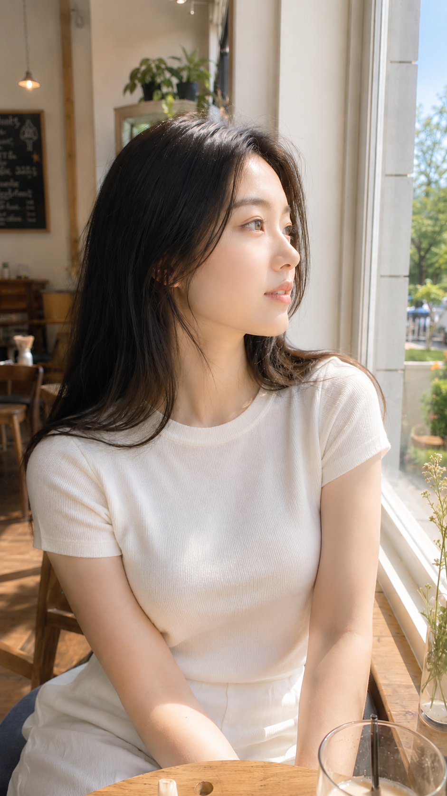
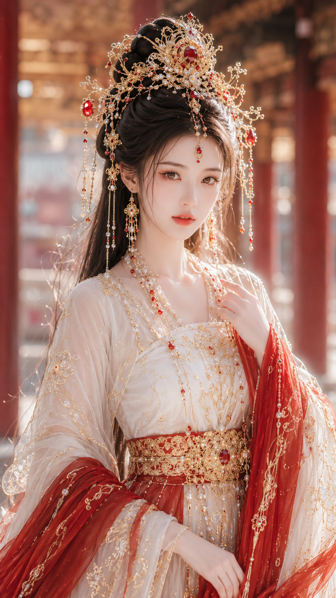
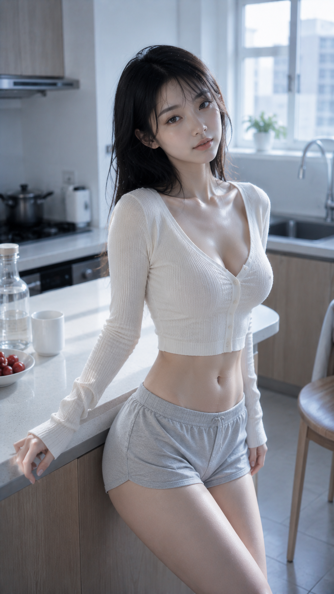
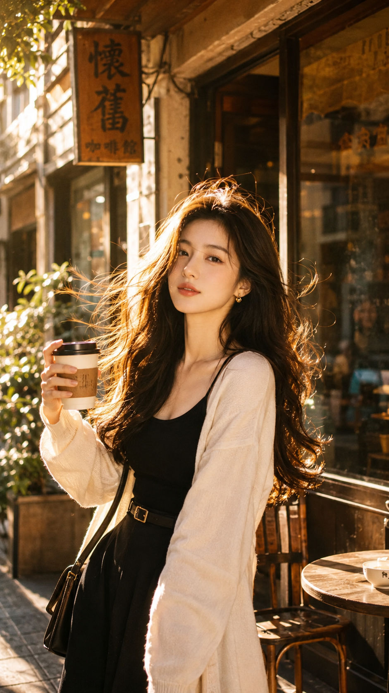
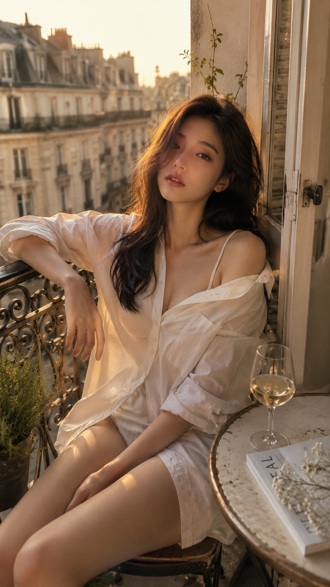

# Female Portrait Director Demo - 女性人像提示词导演演示

## 项目信息

- **原始仓库**: https://github.com/liyue-aigc/female-portrait-director
- **分支**: `female-portrait-director-demo`
- **版本**: V1.6
- **作者**: 李岳
- **星标**: 1.2k
- **许可证**: MIT

## 项目简介

**Female Portrait Director** 是一个模块化的 **Codex Skill**，用于指导和扩展详细的 AI 女性肖像提示词（prompts）。它将简短的肖像输入转化为连贯、可拍摄的"一个摄影瞬间"。

## 核心能力

### 1. 20 种已实现风格

| 编号 | 风格 | Route ID | 分类 |
|------|------|----------|------|
| 1 | 清纯生活照 | `clean-lifestyle` | lifestyle |
| 2 | 纯欲曲线生活照 | `pure-desire-curve` | curve |
| 3 | 都市时尚写真 | `urban-fashion` | fashion |
| 4 | 古风仙侠美人图 | `gufeng-xianxia` | fantasy |
| 5 | 电商服装模特图 | `ecommerce-tryon` | commercial |
| 6 | 复古港风写真 | `retro-hongkong` | lifestyle |
| 7 | 法式慵懒写真 | `french-lazy` | lifestyle |
| 8 | 新中式东方写真 | `new-chinese` | oriental |
| 9 | 活力运动写真 | `sporty-active` | fashion |
| 10 | 旅行假日写真 | `travel-vacation` | lifestyle |
| 11 | 影楼精修写真 | `studio-retouched` | fashion |
| 12 | 东方丰腴写真 | `oriental-voluptuous` | curve |
| 13 | 清冷仙气古风增强版 | `cold-xianxia-enhanced` | fantasy |
| 14 | 明媚华贵古风增强版 | `bright-luxury-gufeng` | fantasy |
| 15 | 超近景真实人脸人像 | `ultra-close-real-face` | realism |
| 16 | 古风贵女水光妆 | `ancient-lady-dewy-makeup` | beauty |
| 17 | 黑珍珠墨金CCD曲线生活照 | `black-pearl-dark-gold-ccd` | curve |
| 18 | 元气丰腴柔光CCD生活照 | `soft-ccd-energetic-voluptuous` | curve |
| 19 | 冷白清透CCD曲线生活照 | `cold-white-clear-ccd-curve` | curve |
| 20 | 低调电影感摄影 | `low-key-cinematic-photography` | cinematic |

### 2. 输出格式

每次生成包含四个部分：

1. **参数锁定结果** - 保留用户指定参数，只细化或稳定化
2. **模块解析** - 导演式模块扩写（年龄、五官、身形、服装、场景、镜头、光线、滤镜）
3. **最终提示词** - 五段式完整提示词
4. **负面约束** - 需要避免的元素

### 3. 工作流

```
用户输入参数 → 风格路由 → 导演设计阶段 → 融合扩写 → 最终提示词
```

### 4. 技术特点

- **模块化解析**: 脸型、身材、服装、场景、相机与姿势、光线、滤镜
- **单一路由选择**: 每次请求通过单一按需风格文件，避免关键词冲突
- **气质叠加**: 通过 Overlay 系统叠加气质增强
- **参考图支持**: 支持身份保留的产品图生成

---

## 风格示例展示

### 示例 1: 清纯生活照 (clean-lifestyle)

**输入参数:**
```
写真风格：清纯生活照
场景方向：咖啡馆靠窗座位
服装方向：白色针织开衫 + 浅色内搭
气质标签：温柔、自然、安静
画幅比例：9:16
```

**生成效果:**



---

### 示例 2: 古风仙侠美人图 (gufeng-xianxia)

**输入参数:**
```
写真风格：古风仙侠美人图
场景方向：云雾山水间的古风庭院回廊
服装方向：月白色唐风幻想大袖衫 + 轻盈披帛 + 银色刺绣腰封
气质标签：清冷、疏离、仙气
五官方向：古典东方美人脸
身形方向：纤细清瘦身形
镜头方向：轻侧身站姿，半身到大腿构图
光线氛围：冷调柔光
滤镜效果：清冷仙气古风滤镜
画幅比例：9:16
```

**生成效果:**



---

### 示例 3: 纯欲曲线生活照 (pure-desire-curve)

**输入参数:**
```
写真风格：纯欲曲线生活照
场景方向：海边步道
服装方向：雾蓝色贴身短款吊带 + 白色轻薄开衫 + 浅色短裤
气质标签：安静、克制、有吸引力
身形吸引力强度：中
线条重点：肩颈、锁骨、腰线、腿部比例
画幅比例：9:16
```

**生成效果:**



---

### 示例 4: 复古港风写真 (retro-hongkong)

**生成效果:**



---

### 示例 5: 法式慵懒写真 (french-lazy)

**生成效果:**



---

## 目录结构

```
female-portrait-director/
├── SKILL.md              # 核心 Skill 定义
├── skill/
│   ├── skill.md          # 主工作流定义
│   ├── help.md           # 首次使用帮助
│   ├── style-registry.md # 风格注册表
│   ├── overlay-registry.md
│   ├── parameter_schema.md
│   ├── public_instructions.md
│   ├── usage_examples.md
│   ├── routes/           # 20 种风格路由
│   │   ├── beauty/
│   │   ├── cinematic/
│   │   ├── commercial/
│   │   ├── curve/
│   │   ├── fantasy/
│   │   ├── fashion/
│   │   ├── lifestyle/
│   │   ├── oriental/
│   │   └── realism/
│   ├── overlays/         # 气质叠加层
│   ├── core/             # 核心模块
│   │   ├── director-gate.md
│   │   ├── parameter-lock.md
│   │   ├── safety-boundary.md
│   │   └── reference-image-lock.md
│   └── references/
│       ├── director-expansion.md
│       └── visual-libraries.md
├── docs/                 # 文档
│   ├── style_guide.md
│   ├── prompt_safety.md
│   ├── versioning.md
│   └── faq.md
├── examples/             # 示例
│   ├── clean_lifestyle_examples.md
│   ├── gufeng_fantasy_examples.md
│   ├── pure_desire_curve_examples.md
│   └── ...
└── assets/
    ├── cases/            # 示例图片
    └── examples/
```

## 安装方式

```bash
# 一键安装
npx skills add https://github.com/liyue-aigc/female-portrait-director/tree/main/skills/female-portrait-director -g

# 更新
npx skills@latest update female-portrait-director -g -y
```

## 使用方法

### 基础用法（仅生成提示词）

```
写真风格：清纯生活照
场景方向：午后安静的咖啡馆靠窗座位
服装方向：米白针织开衫 + 浅色内搭
气质标签：温柔、自然、明确成年
画幅比例：3:4
```

### 直接生成图片

```
使用 $female-portrait-director 直接生成图片：
风格：clean lifestyle portrait
Scene: quiet cafe window seat in the afternoon
Outfit: ivory knitted cardigan + light inner top
Mood: gentle, natural, clearly adult
Aspect ratio: 3:4
```

## 安全边界

项目明确禁止用于：
- 未成年人性化
- 露骨裸体
- 非自愿图像
- 欺骗性身份内容
- 骚扰、诽谤、隐私侵犯

文本生图默认使用虚构、明确成年的人物。参考图工作流允许保留用户本人或已授权成年人物的身份。

---

*演示创建时间: 2026-07-31*
