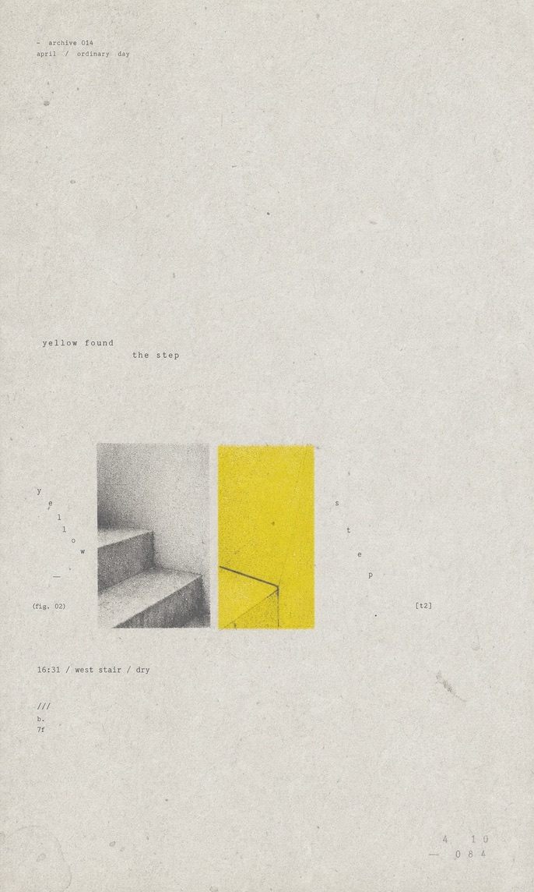

# GC Minimal Zine Poster

[English](README.md) · [简体中文](README.zh-CN.md) · **日本語**

テーマ、短い文章、物、雰囲気、記事のアイデア、写真、コンテンツの概要から、静かでミニマルな ZINE 風エディトリアルポスター用のプロンプトと、対応するラスター画像を生成する Codex スキルです。

呼び出し名は `gc-minimal-zine-poster-v0-1` です。

## ビジュアル方針

各リクエストを、余白を活かした縦長の紙のポスターとして構成します。

- 3:5 比率の古びた紙を思わせるキャンバス
- 70%〜90% のネガティブスペース
- 小さく、視覚的に明確な一つの主題またはビジュアルのまとまり
- セリフ、タイプライター、または等幅書体
- はっきり見える高彩度のカラーアクセント
- ゼロックス、リソグラフ、ハーフトーン、活版印刷、スキャン紙の欠けや質感
- 静かな日本／韓国のインディー ZINE、またはミニマルなエディトリアルデザインの空気感

商業広告のレイアウト、光沢のあるモックアップ、映画的な照明、3D レンダリング、ネオン、密集したスクラップブック、大量の整った文章は避けます。

## 作例

| Night Door | Yellow Step |
| --- | --- |
|  |  |

| Shore Pause | Pause Map |
| --- | --- |
|  |  |

| Typhoon Memory | Moon Tide |
| --- | --- |
|  |  |

## インストール

公開リポジトリを Codex のスキルディレクトリへ直接クローンします。

```bash
git clone https://github.com/LiamGvchi/gc-minimal-zine-poster.git \  ~/.codex/skills/gc-minimal-zine-poster-v0-1
```

スキルがすぐに表示されない場合は、Codex を再起動してください。

## 使い方

スキル名を指定し、テーマまたは概要を渡します。

```text
$gc-minimal-zine-poster-v0-1 を使って、雨の日の古書店をテーマにしたポスターを作って
```

短い文章、記事のアイデア、物、雰囲気、参照画像を渡すこともできます。

## 出力

各回の生成では、次の内容が返されます。

1. 生成されたラスター形式のポスター画像
2. 最終的な画像生成プロンプト
3. 選んだバリエーションの方針と、短い解釈メモ

ワークフローは Standard Mode を使い、デフォルトで画像を生成します。明確に「プロンプトだけ」を求めた場合にだけ、画像を生成せずプロンプトのみを返します。

## リポジトリ構成

- `SKILL.md`：Codex スキルの完全な手順
- `README.md`：英語版の概要とインストール手順
- `LICENSE`：MIT ライセンス
- `examples/`：選定済みの生成ポスター

このリポジトリで公開しているのは、この単独スキルだけです。別の非公開リポジトリに複数のローカルスキルのバックアップを集約する場合がありますが、非公開バックアップの自動化や無関係なスキルはここには含めません。

## ライセンス

MIT。詳細は `LICENSE` を参照してください。
